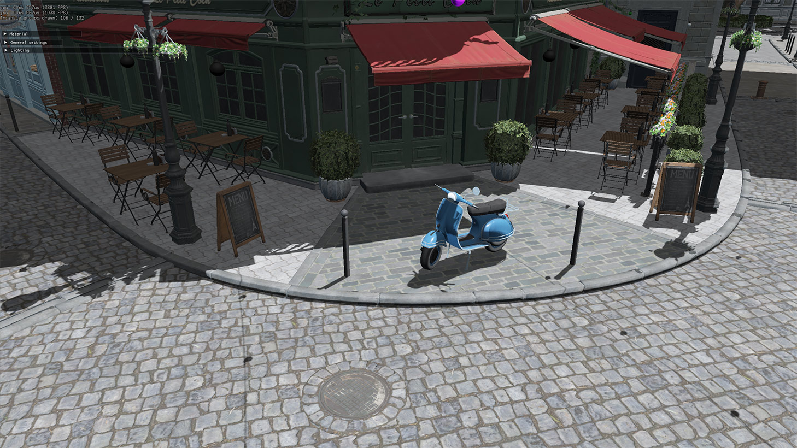
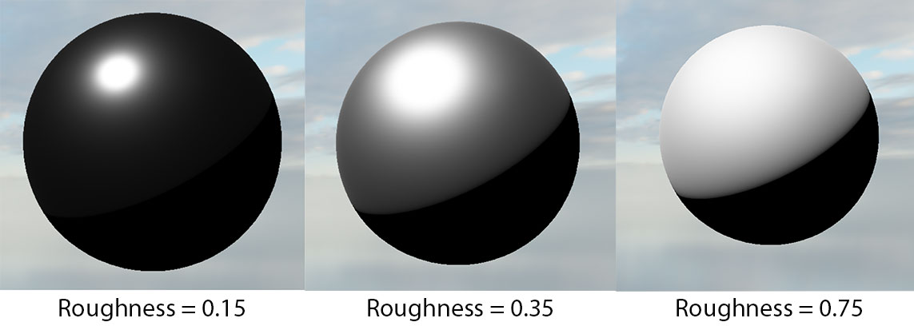
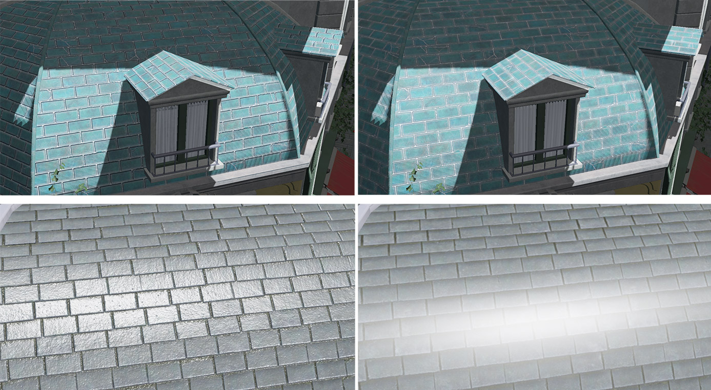
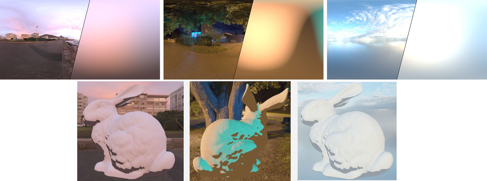

Real-time rendering engine written in C++ and OpenGL 4.3.

Implemented features:
- ImGui integration
- Frustum culling
- Shadow mapping (Percentage closer filtering)
- Microfacet BRDF : Metallic and roughness

- Textures : Diffuse, mettalic, roughness, normals (normal mapping)
- Normal mapping (left with, right without)

- Irradiance Mapping (precomputation of the diffuse irradiance component from an environment map)

- Skyspheres & skyboxes support
- HDR tone mapping (gamma et exposition)
